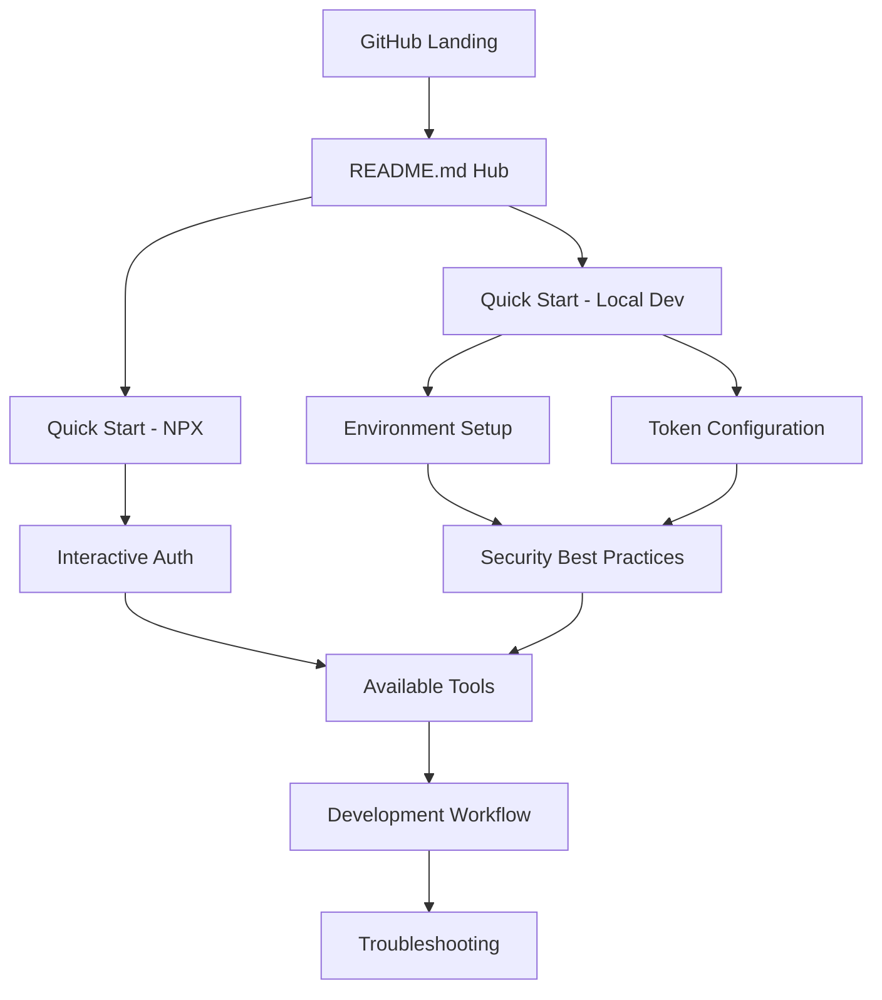

# Design Document

## Overview

The documentation consolidation will transform the current fragmented structure (README.md, SETUP.md, AUTHENTICATION.md, SECURITY.md, PRD.md) into a unified, comprehensive README.md that serves as the single source of truth for users. This design maintains all essential information while dramatically improving discoverability and reducing maintenance overhead through strategic content organization and progressive disclosure.

## Steering Document Alignment

### Technical Standards (tech.md)
The design follows the documented principle of "Read-Only by Design" by consolidating information without modifying functionality. It aligns with "Conversational Native" design by making documentation more approachable and AI-assistant friendly. The consolidation supports TypeScript development practices by maintaining clear code examples and configuration patterns.

### Project Structure (structure.md)
Following the "Single Responsibility Principle" documented for files, the new README.md will serve as the primary documentation hub. The design maintains "Clear Interfaces" by providing well-defined navigation paths and preserves "Documentation Standards" through consistent formatting and comprehensive coverage.

## Code Reuse Analysis

### Existing Components to Leverage
- **Current README.md Structure**: Overview, quick start patterns, and tool descriptions will be preserved and enhanced
- **SETUP.md Step-by-Step Approach**: Detailed installation procedures will be integrated into expanded setup sections
- **AUTHENTICATION.md Method Documentation**: Both interactive and token-based authentication guides will be consolidated
- **SECURITY.md Best Practices**: Security guidance will be embedded contextually throughout the document

### Integration Points
- **Package.json Scripts**: All existing task references and development workflows remain unchanged
- **Configuration Examples**: All Claude Desktop configurations and environment setups are preserved
- **External Dependencies**: Task runner, NPX installation, and development tool integrations maintained
- **Version Control**: No changes to core project structure, only documentation organization

## Architecture

The consolidated documentation follows a progressive disclosure architecture, organizing information by user journey rather than technical domain. The design uses a hierarchical structure that guides users from initial discovery through advanced configuration and troubleshooting.

### Modular Design Principles
- **Single File Responsibility**: README.md becomes the comprehensive user-facing documentation hub
- **Component Isolation**: Each major section (Quick Start, Setup, Authentication, Security) remains distinct but integrated
- **Service Layer Separation**: Clear delineation between user-facing instructions and technical implementation details
- **Utility Modularity**: Reusable configuration patterns and code examples throughout



## Components and Interfaces

### Header & Overview Section
- **Purpose:** Project introduction, value proposition, and immediate appeal
- **Interfaces:** Quick navigation links, feature highlights, example use cases
- **Dependencies:** Existing project branding and core value messaging
- **Reuses:** Current README overview with enhanced examples and clearer positioning

### Quick Start Hub
- **Purpose:** Immediate actionable paths for different user types (end users vs developers)
- **Interfaces:** NPX installation, local development setup, task runner integration
- **Dependencies:** Package.json configuration, NPM registry, development toolchain
- **Reuses:** Current quick start approaches with streamlined decision tree

### Integrated Authentication Guide
- **Purpose:** Comprehensive authentication coverage for both methods within setup flow
- **Interfaces:** Interactive authentication steps, token-based configuration, troubleshooting
- **Dependencies:** Jellyfin server API, MCP authentication system, credential management
- **Reuses:** AUTHENTICATION.md content integrated contextually into setup workflows

### Embedded Security Guidance
- **Purpose:** Security best practices presented at point of need rather than separate document
- **Interfaces:** Credential management, configuration security, threat awareness
- **Dependencies:** Environment variable systems, file permissions, version control practices
- **Reuses:** SECURITY.md recommendations embedded in relevant configuration sections

### Comprehensive Setup & Configuration
- **Purpose:** Complete setup coverage from installation through advanced configuration
- **Interfaces:** Step-by-step instructions, troubleshooting, development workflows
- **Dependencies:** Node.js ecosystem, Jellyfin server configuration, Claude Desktop setup
- **Reuses:** SETUP.md detailed procedures integrated with enhanced error handling

### Development & Contribution Section
- **Purpose:** Advanced user and contributor guidance consolidated from multiple sources
- **Interfaces:** Task automation, testing procedures, CI/CD workflows, contribution guidelines
- **Dependencies:** Development toolchain, testing infrastructure, project governance
- **Reuses:** Current development documentation with enhanced organization

## Data Models

### User Journey Flow
```typescript
interface UserJourney {
  entryPoint: 'quick-start' | 'setup' | 'development' | 'troubleshooting'
  userType: 'end-user' | 'developer' | 'contributor'
  authMethod: 'interactive' | 'token-based' | 'undecided'
  setupType: 'npx' | 'local-development' | 'production'
  securityLevel: 'basic' | 'advanced' | 'enterprise'
}
```

### Content Organization Model
```typescript
interface DocumentSection {
  id: string
  title: string
  level: 1 | 2 | 3 | 4  // Heading hierarchy
  dependencies: string[]  // Prerequisites from other sections
  audience: UserType[]
  originalSource: 'README' | 'SETUP' | 'AUTHENTICATION' | 'SECURITY' | 'PRD'
  preserved: boolean  // Ensures no content loss during consolidation
}
```

## Error Handling

### Error Scenarios
1. **Missing Prerequisites:** User attempts setup without required dependencies
   - **Handling:** Clear prerequisite checklist with verification commands
   - **User Impact:** Guided resolution with specific error identification

2. **Authentication Failures:** Interactive or token-based authentication issues
   - **Handling:** Comprehensive troubleshooting section with common failure modes
   - **User Impact:** Step-by-step debugging with alternative approaches

3. **Configuration Conflicts:** Multiple authentication methods or environment conflicts
   - **Handling:** Clear decision tree for choosing appropriate authentication method
   - **User Impact:** Guided configuration cleanup and method selection

4. **Connection Issues:** Network, firewall, or Jellyfin server accessibility problems
   - **Handling:** Network diagnostics section with testing commands
   - **User Impact:** Systematic troubleshooting from basic connectivity to advanced network issues

## Testing Strategy

### Unit Testing
- **Content Accuracy:** Verify all consolidated content matches original sources
- **Link Integrity:** Validate all internal references and external links function correctly
- **Code Examples:** Test all configuration examples and command-line instructions

### Integration Testing
- **User Journey Testing:** Follow complete workflows from fresh installation to working configuration
- **Cross-Platform Validation:** Verify instructions work across different operating systems
- **Version Compatibility:** Ensure examples work with current package versions

### End-to-End Testing
- **New User Experience:** Complete setup following only the consolidated README
- **Migration Testing:** Existing users can transition smoothly without information loss
- **Troubleshooting Validation:** Common error scenarios have working resolution paths

## Implementation Strategy

### Phase 1: Content Inventory and Mapping
- Catalog all existing content across documentation files
- Map content to user journeys and identify overlaps/redundancies
- Preserve critical information in structured format for integration

### Phase 2: Progressive Disclosure Design
- Design hierarchical information architecture
- Create clear navigation and internal linking strategy
- Develop section templates that maintain consistency

### Phase 3: Content Integration and Enhancement
- Consolidate content following progressive disclosure principles
- Enhance examples and add missing transition information
- Integrate security and authentication guidance contextually

### Phase 4: Validation and Refinement
- Test complete user workflows using only consolidated documentation
- Validate against all original requirements
- Refine based on usability and completeness testing

## Backward Compatibility Considerations

### Information Preservation
- All critical setup information maintained
- Security guidance preserved and enhanced
- Authentication methods fully documented
- Development workflows completely covered

### Reference Migration
- Internal links updated to point to appropriate sections
- External references (from other projects) accommodated through clear section anchors
- Documentation cross-references maintained for ecosystem compatibility
